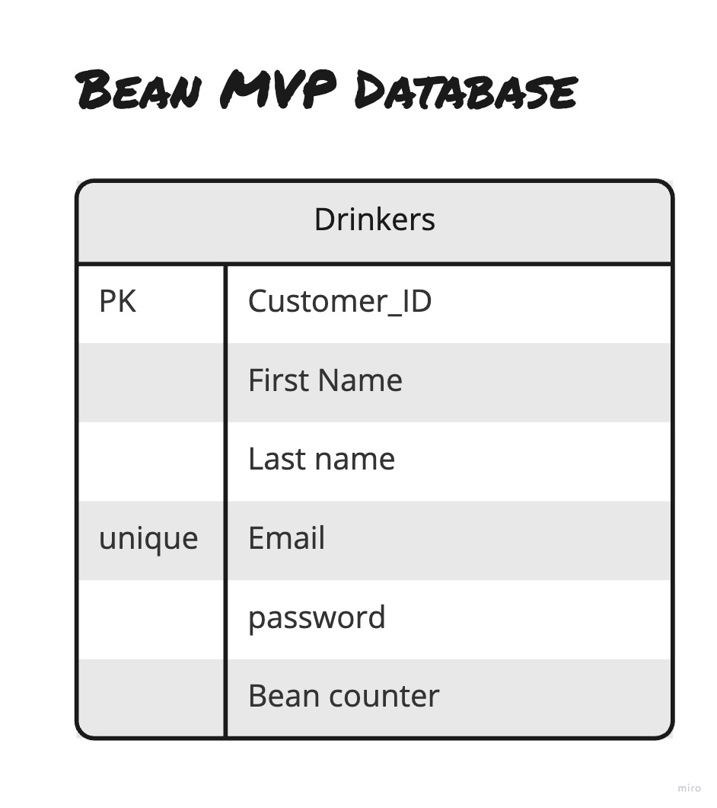
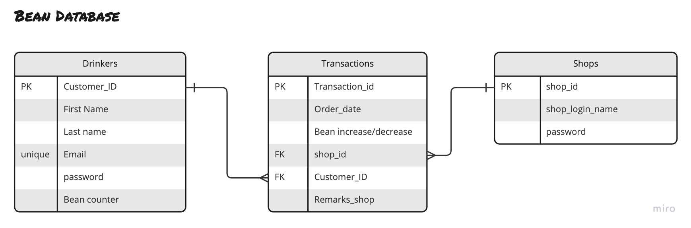

# Bean App

## Created by
Abhiram Nandakumar
Dave Kempsell
Ibrahim Pala
Michael Chan

## Database design

Wireframing

Our project contains two main user journies. 
1. The 'coffee lover' who collects loyalty points called 'beans'
2. The 'coffee shop owner' who provides rewards based on past purchases

The Coffee Lover Flow

The Coffee Shop Owner Flow

